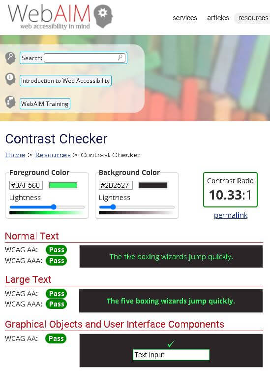
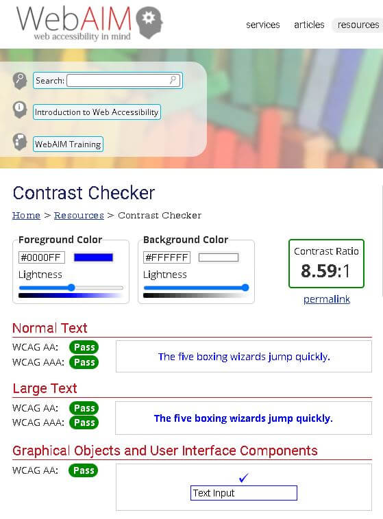
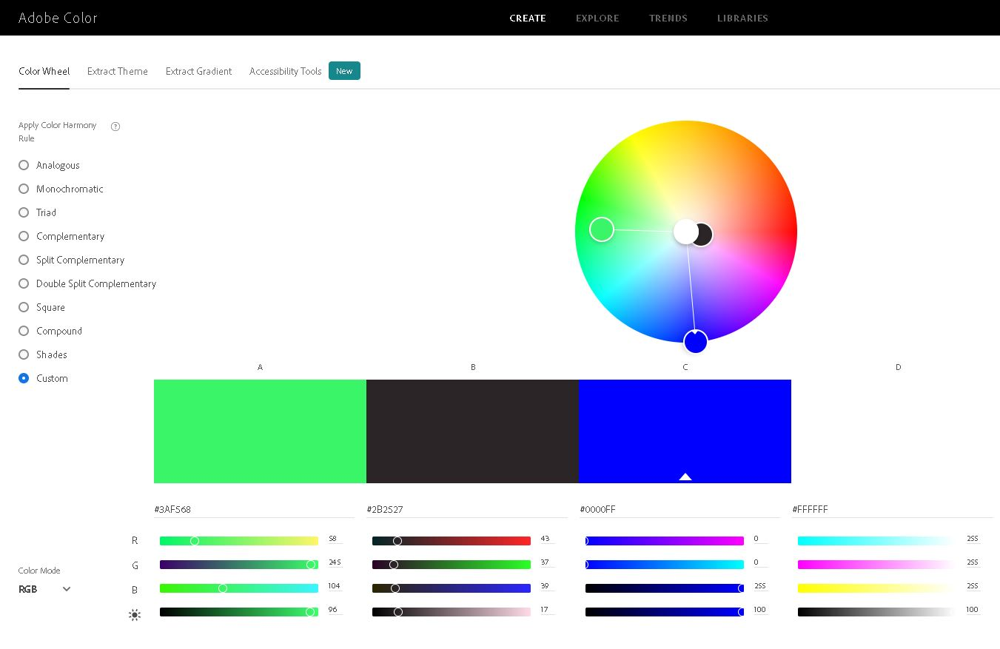
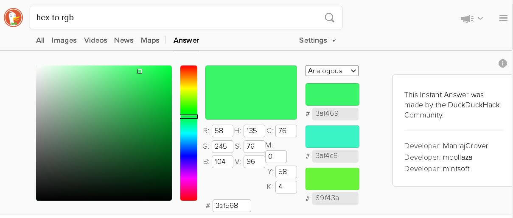
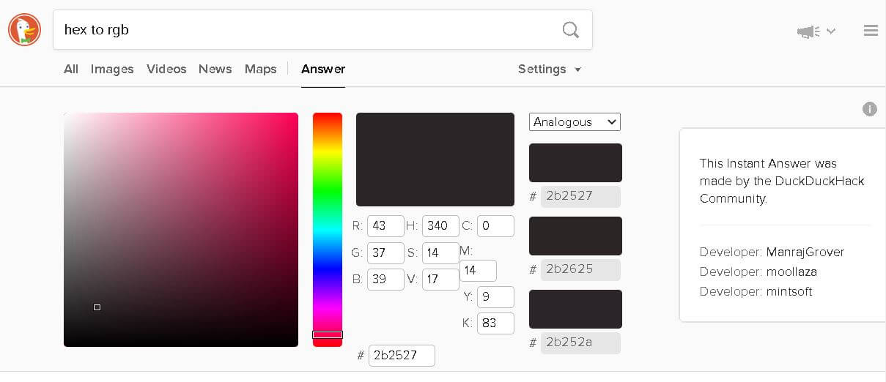
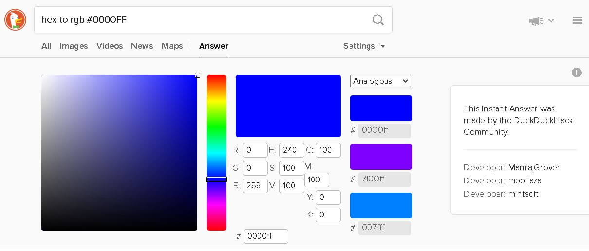

# Portfolio_Project_1
 The History of the Silicon Based Desktop Computer

## Overview of Project (2 paragraphs)
Developing a website on the conventional desktop computer using HTML5 and CSS3.

[Insert Picture of Final Project Simplest Version On Time Under Budget](insert website)

## Features

The parts of the project

Value of feature to user

who website is for:
    - People who have an interest in the history of computers.

What they want to achieve
    - To get a quick overview of some of the main points of computer history, with some detail on interesting technologies.

How the project achieves this
    - This website uses CSS Style Sheets to present information on computer history in a way that is intuitive and creates a positive user experience.

### Existing features

- Wireframe in Balsamiq

    #### Table  of Wireframe Rough Plan Sketch made in using Balsamiq
<table>
    <tr>
        <td></td>
        <td></td>
        <td></td>
        <td></td>
        <td></td>
    </tr>
    <tr>
        <td>
Computer History Timeline Image Created with Balsamiq
</td>
        <td>
Tech Event 1
</td>
        <td>
Tech Event 2
</td>
        <td>
Tech Event 3
</td>
        <td>
User Survey Form Image
</td>
    </tr>
</table>

- There are 5 webpages on the site.
    - Home Page with Timeline
    - 3 Key technologies for the computer
    - Survey Form to gather user feedback about the website.

- The website features a <form> element. This is a survey of how the user found the content and overall impression of the website.

(Use love-running as template)

- Button

- Matrix Color Scheme

- __Navigation Bar__

    - Featured on all three pages.
    - Responsive element.

#### Table  of Technologies Used
<table>
    <tr>
        <td></td>
        <td></td>
        <td></td>
        <td></td>
        <td></td>
        <td></td>
        <td></td>
        <td></td>
    </tr>
    <tr>
        <td>
HTML5
</td>
        <td>
CSS3
</td>
        <td>
Gitpod
</td>
        <td>
Git
</td>
        <td>
GitHub
</td>
        <td>
Stack Overflow
</td>
        <td>
W3Schools
</td>
        <td>
MDN Web Docs
</td>
    </tr>
</table>

### Features Left to Implement

- Tried to make a reflection like shine effect occur above the buttons on the navigation bar as well as below.  However, can only use a single before pseudo-class on a single element.
- Make buttons rotate, giving the illusion of shifting perspective when user moves mouse.
- Add light switch to switch from Matrix theme green font on black background to blue font on white background.
- Add audio to website, with image of an amplifier, switch, and sign asking if user wants to turn the sound on.

## Testing

- Details of testing.

    ### Usability Testing
    #### Consistency testing
    A unified theme was needed to communicate that the website was about computer history.  So, the color scheme of green and black used in the 1999 Movie "The Matrix" was used.

    #### Accessibility Standards
    AAA requires a contrast ratio of 7:1.
    [WCAG 2.1 Part 1.4.6 Contrast(Enhanced) - Level AAA](https://www.w3.org/WAI/WCAG21/quickref/)

    #### Visibility Testing
    For contrast, bright green on black rated well.

    As a secondary color combination, white and light blue were too low contrast.
    So, blue color was deepened.

### Validator Testing

- HTML
- [W3C validator](https://validator.w3.org/nu/?doc=https%3A%2F%2Fcode-institute-org.github.io%2Flove-running-2.0%2Findex.html)

CSS
- [(Jigsaw) validator](https://jigsaw.w3.org/css-validator/validator?uri=https%3A%2F%2Fvalidator.w3.org%2Fnu%2F%3Fdoc%3Dhttps%253A%252F%252Fcode-institute-org.github.io%252Flove-running-2.0%252Findex.html&profile=css3svg&usermedium=all&warning=1&vextwarning=&lang=en#css)

## User Experience
### Accessibility
High Contrast

## Browser Compatibility
- Box-shadow inset parameter not used, as only partially supported on Internet Explorer 9.
- Browser Compatibility: inset not used as shorthand for positioning top right bottom left as no support for functionality in Edge, Internet Explorer, Opera Android or Samsung Internet. 
- Browser Compatibility: hsl CSS property, alpha parameter: Internet Explorer Browser does not support alpha parameter in hsl hue staturation lightness property in CSS Stylesheets.

## Color Scheme
- Matrix Green on Black has a contrast ratio of 10.33:1, which exceeds the 7:1 ratio specification for [W3C Web Accessibility Initiative (WAI).](https://www.w3.org/WAI/)

 
#### Figure above shows results of color accessibility check for high contrast green font on black background color combination

#### Figure above shows results of color accessibility check for high contrast blue font on white background color combination

#### Figure above shows green, black, blue and white colors on Adobe Color wheel

#### Figure above shows green used in Matrix color theme

#### Figure above shows black used in Matrix color theme

#### Figure above shows blue used in Secondary color theme

#### Figure above shows white used in Secondary color theme

## Bugs
### Fixed Bugs
Bug:
- Home button on Navigation bar on Home page was not being styled by CSS.
Cause:
- The button id deleted from anchor for home page in Navigation bar in error.
Fix:
- The button id reinstated to anchor for home page in Navigation bar.

Bug:
Since the addition of unordered list and list item tags to Navigation bar on home page:
- Navigation bar is displaying vertically not horizontally
- Bullets are present to the left of buttons
Cause:
- Unordered list and list item tags.
Fix:
- Add bulletless class selector rule to CSS stylesheet with list-style property set to a value of none.
- Add bulletless class to list items on home page.
### Unfixed Bugs
#### Home page bugs
##### Navigation bar Bugs
Bug:
Before the addition of unordered list and list item tags:
- Navigation bar was not stetching fully horizontally across screen.

#### Images 9 and 10 are named with capitalised .JPG endings.
- To try and address this, the ending was amended to lowercase, .jpg in keeping with the rest of the .jpg files.
- However, when the links were updated to .jpg they did not work.
- It emerged that even though the file was renamed to .jpg, the system stil refered to them as .jpg
- In the interest of simplicity, the files were reverted to the orignal .JPG extension.
    - Note: Full names for Images 9 and 10 are 9_hex_to_rgb_hash3af568.JPG and 10_hex_to_rgb_hash2b2527.JPG

## Deployment

process to deploy on GitHub.

Live Link:

## Media

- photos
- images
    - images online
        - [The Matrix](https://external-content.duckduckgo.com/iu/?u=https%3A%2F%2Ftse4.mm.bing.net%2Fth%3Fid%3DOIP.SmUcZE7l8Du70D59UMg1_wHaGo%26pid%3DApi&f=1)
    - images in assets>images
        - 1_time_line_sketch.png
        - 2_Tech_event_1.png
        - 3_Tech_Event_2.png
        - 4_Tech_Event_3.png
        - 5_User_Survey_Form.png
        - 6_color_contrast_check_matrix.png
        - 7_blue_white_color_combination.jpg
        - 8_green_black_blue_white_colors.jpg
        - 9_hex_to rgb_hash3af568.JPG
        - 10_hex_to_rgb_hash2b2527.JPG
        - 11_hex_to_rgb_hash0000FF.jpg
        - 12_hex_to_rgb_hasFFFFFF.jpg

## Reference Sources
- Here are reference sources used in the project.
##### Reference Sources  / Readme / Image Alignment
- [Putting two images on the same line by skipping line break](https://stackoverflow.com/questions/49633290/how-to-stack-images-horizontally-in-readme-md)

- [Display a Table in Readme](https://stackoverflow.com/questions/24319505/how-can-one-display-images-side-by-side-in-a-github-readme-md)

- [Using Span  W3Schools reference](https://www.w3schools.com/tags/tag_span.asp)

    ##### Reference Sources  / Readme / Markdown

- [Markdown text alignment using the center tag](https://stackoverflow.com/questions/14051715/markdown-native-text-alignment)

- [Markdown inline style for image alignment](https://stackoverflow.com/questions/255170/markdown-and-image-alignment)

- How to use links in README [Link to Pages](https://docs.readme.com/docs/linking-to-pages)

    ##### Reference Sources  / All HTML Pages
    Use unordered list element with list item elements for each anchor element to make navigation bar stretch across page.
    - [how to make navigation bar stretch across the page (HTML)](https://stackoverflow.com/questions/16629835/how-to-make-navigation-bar-stretch-across-the-page-html)
    - [How To Make Navigation Bar Stretch Across The Page](https://www.aurigait.com/blog/how-to-make-navigation-bar-stretch-across-the-page/)
    - [CSS Lists ](https://www.w3schools.com/CSS/css_list.asp)
    - [HTML Lists ](https://www.w3schools.com/HTML/html_lists.asp)

    ##### Reference Sources  / HTML on Home Page
    ###### Content / head element
    - [X-UA-Compatible Tag, older Microsoft Browser support](https://stackoverflow.com/questions/6771258/what-does-meta-http-equiv-x-ua-compatible-content-ie-edge-do)
    - [Defining document compatibility](https://docs.microsoft.com/en-gb/previous-versions/windows/internet-explorer/ie-developer/compatibility/cc288325(v=vs.85))
    ###### Content / body element
    - [How to indent a header?](https://stackoverflow.com/questions/33541600/how-to-indent-a-header)

    ##### Reference Sources / HTML / CSS
    - Use list style none in CSS to remove bullet from unordered list item. [How to Remove, Replace or Style List Bullets with Pure CSS](https://www.w3docs.com/snippets/css/how-to-remove-replace-or-style-list-bullets-with-css.html)

    ##### Reference Sources / style.css file
    - [Inline CSS formatting best practices - Two questions](https://stackoverflow.com/questions/5732486/inline-css-formatting-best-practices-two-questions)
    - [CSS Syntax ](https://www.w3schools.com/Css/css_syntax.asp)
    - First source using :root to declare css variables early in CSS stylesheet. [CSS variable](https://www.youtube.com/watch?v=6xNcXwC6ikQ)
    - Second source using :root to declare css variables early in CSS stylesheet. [CSS variables in MDN Web Docs](https://developer.mozilla.org/en-US/docs/Web/CSS/:root)
    ###### Using CSS Box sizing
    - First source using box sizing in CSS. [Reset box sizing](https://www.youtube.com/watch?v=6xNcXwC6ikQ)
    - Second source using box sizing in CSS. [Box Sizing](https://css-tricks.com/box-sizing/)
    - Third source using box sizing in CSS. [CSS Box Sizing,  W3Schools article](https://www.w3schools.com/css/css3_box-sizing.asp)
    - Fourth source using box sizing in CSS. [CSS Box Sizing Property,  W3Schools article](https://www.w3schools.com/CSSref/css3_pr_box-sizing.asp)
    ###### Pseudo-elements in CSS
    - CSS Pseudo-elements [Before and After pseudo elements explained - part one: how they work](https://www.youtube.com/watch?v=zGiirUiWslI&list=PL4-IK0AVhVjPBX_HelwDlNsTiyr2YGSBw&ab_channel=KevinPowell)
    - [CSS Pseudo-elements ](https://www.w3schools.com/CSS/css_pseudo_elements.asp)
    ###### Using the "before" selector in CSS
    - Source 1 for CSS before selector. [CSS ::before Selector,  W3Schools article](https://www.w3schools.com/cssref/sel_before.asp)
    - Source 2 for CSS before selector. [CSS ::before selector](https://developer.mozilla.org/en-US/docs/Web/CSS/::before)
    ###### Using the "after" selector in CSS
    - Source 1 for CSS after selector. [CSS ::after Selector,  W3Schools article](https://www.w3schools.com/cssref/sel_after.asp)
    - Source 2 for CSS after selector. [CSS ::after selector](https://developer.mozilla.org/en-US/docs/Web/CSS/::after)
    ###### Can only target a single HTML element with a single id selector
    - Short answer? No because the browser will only render the first one. [Can a HTML element have multiple unique ID attributes? [duplicate]](https://stackoverflow.com/questions/16936132/can-a-html-element-have-multiple-unique-id-attributes)
    ###### Can only target a single HTML element with a single before pseudo-element 
    - In CSS2.1, an element can only have at most one of any kind of pseudo-element at any time. (This means an element can have both a :before and an :after pseudo-element — it just cannot have more than one of each kind.) [Can I have multiple :before pseudo-elements for the same element?](https://stackoverflow.com/questions/11998593/can-i-have-multiple-before-pseudo-elements-for-the-same-element)
    ###### Pseudo-classes
    - A CSS pseudo-class is a keyword added to a selector that specifies a special state of the selected element(s). For example, :hover can be used to change a button's color when the user's pointer hovers over it. [Pseudo-classes](https://developer.mozilla.org/en-US/docs/Web/CSS/Pseudo-classes)
    ###### CSS position Property
    - [CSS position Property ](https://www.w3schools.com/cssref/pr_class_position.asp)
    - Although there is support in new inset property, this was avoided for Browser Compatibility. [(No) CSS shorthand for positioning](https://stackoverflow.com/questions/10855276/css-shorthand-for-positioning)
    - New inset property, which acts like shorthand. Not used for Browser Compatibility. [inset](https://developer.mozilla.org/en-US/docs/Web/CSS/inset#browser_compatibility)
    ###### CSS left property
    - The left CSS property pertains to the horizontal position of an element. [left](https://developer.mozilla.org/en-US/docs/Web/CSS/left)
    ###### CSS transform
    - If perspective() is one of multiple function values, it must be listed first. [transform](https://developer.mozilla.org/en-US/docs/Web/CSS/transform)
        - The perspective() CSS function defines a transformation that sets the distance between the user and the z=0 plane [perspective()](https://developer.mozilla.org/en-US/docs/Web/CSS/transform-function/perspective())
        - [CSS Transform: Rotating a 3D object with perspective based on mouse position](https://www.armandocanals.com/posts/CSS-transform-rotating-a-3D-object-perspective-based-on-mouse-position.html)
        - The rotate CSS function [rotate()](https://developer.mozilla.org/en-US/docs/Web/CSS/transform-function/rotate())
        - The rotateX CSS function defines a transformation that rotates an element around the horizontal axis.[rotateX()](https://developer.mozilla.org/en-US/docs/Web/CSS/transform-function/rotateX())
    ###### CSS filter Property
    - CSS Syntax for filter Property includes setting value to blur [CSS filter Property ](https://www.w3schools.com/CSSref/css3_pr_filter.asp)
    ###### CSS blur()function
    - The blurCSS function applies a Gaussian blur to the input image. [blur](https://developer.mozilla.org/en-US/docs/Web/CSS/filter-function/blur())
    ###### CSS hover Selector
    - [CSS hover Selector ](https://www.w3schools.com/cssref/sel_hover.asp)

    ###### Using Asterisk selector in CSS
    The CSS Asterisk selector * selects all HTML elements.
    - First source for asterisk selector. [CSS asterisk * selector](geeksforgeeks.org/what-is-the-use-of-asterisk-selector-in-css/)
    - Second source for asterisk selector. [CSS asterisk * selector](https://stackoverflow.com/questions/1204275/what-does-an-asterisk-do-in-a-css-selector)
    - Third source for asterisk selector. [CSS asterisk * selector ](https://www.w3schools.com/cssref/sel_all.asp)
    ###### Using CSS padding property
    - [CSS padding Property ](https://www.w3schools.com/CSSref/pr_padding.asp)
    ###### Using CSS Grid
    - [CSS Grid ](https://www.w3schools.com/css/css_grid.asp)
    ###### Using rem units
    - In CSS, the size unit rem stands for root element. [Using rem versus em size units in CSS](https://stackoverflow.com/questions/13941275/how-does-rem-differ-from-em-in-css)
    - [Rem in CSS: Understanding and Using rem Units](https://www.sitepoint.com/understanding-and-using-rem-units-in-css/)
    ###### Cursor Pointer
    - Using a CSS declaration with cursor property set to a value of pointer, to display pointing hand in CSS. [Cursor property set to value of pointer ](https://www.w3schools.com/csSref/pr_class_cursor.asp)
        - [Practice page for cusor set to pointer in CSS ](https://www.w3schools.com/csSref/tryit.asp?filename=trycss_cursor)
    ###### Anatomy of a CSS Rule
    - How to refer to the different parts of a CSS Rule. [Anatomy of a CSS Rule](https://ironion.com/blog/2015/06/12/anatomy-of-a-css-rule/)

##### Reference Sources / style.css file / Color
###### Color HEX
- [How to use HEX color in CSS ](https://www.w3schools.com/colors/colors_hexadecimal.asp)

###### CSS Color Wheel
- [Adobe color-wheel](https://color.adobe.com/create/color-wheel)
###### Colors - Tool for selecting multiple colors for website. [Adobe Color Wheel](https://color.adobe.com/create/color-wheel)
- [Color design theory](https://blog.hubspot.com/marketing/color-theory-design)
- Color wheel calculator tool for picking website. [Sessions College](https://www.sessions.edu/color-calculator-results/?colors=2b2527,22f0e2,1d99ff,32d16c,3af568,ffffff)
- Tool for checking Accessibility of Color combination chosen for website. [Accessibility of color combination Tool](https://material.io/resources/color/#!/?view.left=1&view.right=1&primary.color=ffffff&secondary.color=2b2527&primary.text.color=1d99ff&secondary.text.color=3af568)
- Used this site to check if font/background combinations are above 7:1 contrast ratio.[Web Accessibility In Mind WebAIM](https://webaim.org/resources/contrastchecker/)
- [Add inline style to h2 element to center content](https://stackoverflow.com/questions/41439730/how-to-center-a-h2)

###### CSS HSL Colors
- [CSS HSL Colors ](https://www.w3schools.com/css/css_colors_hsl.asp)
-  Browser Compatibility: hsl CSS property, alpha parameter: Internet Explorer Browser does not support alpha parameter in hsl hue staturation lightness property in CSS Stylesheets [hsl()](https://developer.mozilla.org/en-US/docs/Web/CSS/color_value/hsl())
- [CSS hsl() Function ](https://www.w3schools.com/csSref/func_hsl.asp)
- [Colors HSL ](https://www.w3schools.com/colors/colors_hsl.asp)

###### CSS text shadow
- How to use text shadow in CSS Stylesheets. CSS Syntax uses horizontal shadow, vertical shadow, blur radius, and color parameters. [CSS text-shadow Property ](https://www.w3schools.com/cssref/css3_pr_text-shadow.asp)

###### CSS box shadow
- Browser Compatibility: Only Partial Support in Internet Explorer 9 for Box shadow inset parameter. [box-shadow](https://developer.mozilla.org/en-US/docs/Web/CSS/box-shadow)
- [CSS box-shadow Property ](https://www.w3schools.com/CSSref/css3_pr_box-shadow.asp)
- [CSS Box Shadow ](https://www.w3schools.com/css/css3_shadows_box.asp)
- [box-shadow](https://css-tricks.com/almanac/properties/b/box-shadow/)

##### Fonts
###### CSS Font Size
- [CSS Font Size ](https://www.w3schools.com/css/css_font_size.asp)
###### Google Fonts
- Using Google fonts in a few of my pages and hit a wall when trying to use variations of a font.  Importing three faces, Normal, Bold, ExtraBold via the link tag.  How to use the variants of the font in my CSS. Answer: They use regular CSS.  Just use regular font family property. Now decide what "weight" the font should have by adding font weight property (values in parentheses) as needed for semi-bold, for bold (700), for extra bold (800). [Specifying Style and Weight for Google Fonts](https://stackoverflow.com/questions/7256065/specifying-style-and-weight-for-google-fonts#7256119)
###### How to use Google Fonts
- How to use Google Fonts [CSS Google Fonts ](https://www.w3schools.com/csS/css_font_google.asp)
- [Roboto Google font code](https://fonts.google.com/specimen/Roboto)
###### Open Sans Google Font
- [Open Sans Google font code](https://fonts.google.com/specimen/Open+Sans?query=Open+sans)

### Reference Sources / Non-content support material

##### Content / Git
###### Git: Methods of adding Header and Message to git commit messages
- How to use console VIM editor in Integrated Development Environment to add git commit messages with line breaks. [Learning How to Git: Creating a (Longer) Commit Message](https://haydar-ai.medium.com/learning-how-to-git-creating-a-longer-commit-message-16ca32746c3a)
- How to add a line break to a git commit message from the terminal, using "here document". [How to commit with a header and a message in git from the command line](https://stackoverflow.com/questions/5064563/add-line-break-to-git-commit-m-from-the-command-line)
    - Here document is a file literal or input stream literal.  It behaves as a separate file. It originates in Unix shell and is found in Bash. [Here document](https://en.wikipedia.org/wiki/Here_document)
        - EOF stands for End Of File. [EOF](https://acronyms.thefreedictionary.com/EOF)
###### Git: How to open editor from terminal, why not to punctuate commit messages
- How to open default editor from terminal in Integrated Development Environment to write a git commit message. Also, reasons not to use punctuation marks. [How to Write Good Commit Messages in GitHub?
](https://www.geeksforgeeks.org/how-to-write-good-commit-messages-in-github/)
- Reason not to use commas in git commit messages. Also, if exporting git commit messages to csv, how to switch to semicolon delimitors instead of commas. This allows export of commit messages with commas, without messages splitting into different cells at each comma.  [How to escape commas inside commit title/subject in Git logs?](https://stackoverflow.com/questions/58907495/how-to-escape-commas-inside-commit-title-subject-in-git-logs)
###### Viewing GitHub Commits
- [How to view git commits on GitHub Repositories](https://stackoverflow.com/questions/65373797/where-can-i-see-the-commit-history-on-the-github-website)
- [Image (from stackoverflow link above) highlighting where to access git commits](https://i.stack.imgur.com/HjDQX.png)
###### Comparing Git Commits
- [Git: How to compare two different versions of a file](https://alvinalexander.com/photos/git-compare-two-different-versions-of-a-file/)
###### IDE Integrated Development Environment
- What does the abbreviation IDE stand for? [What Is an IDE? | Codecademy](https://www.codecademy.com/articles/what-is-an-ide)

##### Content / Vim
###### Set word wrap at End of Line
- How to set Vim to word wrap at the end of a line, for use in terminal to write commit messages. [Automatic word wrapping](https://vim.fandom.com/wiki/Automatic_word_wrapping)
- Hard wrap recommended at 72 characters for git commits using Vim. [How to wrap git commit comments?](https://stackoverflow.com/questions/2119942/how-to-wrap-git-commit-comments)

##### General notes
- No CSS in README with GitHub. [GitHub does not allow for CSS to affect README.md files](http://stackoverflow.com/questions/51956361/ddg#51956450)
- How to align images in Readme using HTML. [Center images in README](https://stackoverflow.com/questions/12090472/how-do-i-center-an-image-in-the-readme-md-on-github/62383408#62383408)
- [GitHub Repository on how to do an image in a README_using Markdown](https://github.com/alandtsang/README)
- [Anatomy of the html tag](https://clearlydecoded.com/anatomy-of-html-tag)
- Resource for Markdown. [R_Markdown](https://rmarkdown.rstudio.com/)

###### Images side by side in markdown
- [Stack two images horizontally in R_Markdown](https://community.rstudio.com/t/how-to-stack-two-images-horizontally-in-r-markdown/18941)

## Media References

###### Matrix Color Scheme
- Matrix colors used as a theme for website. [Green and Black Colors taken from this image](https://www.mobygames.com/images/shots/l/369148-the-matrix-online-windows-screenshot-every-time-an-area-loads.jpg)

## Technologies Used

###### Image Compressors
- Default image compressor. [TinyPNG](https://tinypng.com/)
- Used any time TinPNG gave jfif file, which will not run in Integrated Development Environment. [JPEG_compressor](https://compressjpeg.com/)

## Templates Referenced

#### Templates Referenced / Readme
- [Template used for this Readme](https://github.com/lucyrush/readme-love-running/blob/master/media/love_running_nav.png)

- [CSS Neon Button Worked Example](https://www.youtube.com/watch?v=6xNcXwC6ikQ&ab_channel=KevinPowell)

- [love-running repository](https://github.com/Code-Institute-Solutions/love-running-2.0-sourcecode/tree/main/01-getting-set-up/01-getting-set-up)

- [git-pod-full-template](https://github.com/Code-Institute-Org/gitpod-full-template)

- CodeInstitute lessons on the Editor were used as a template for how to showcase technologies.  The technologies used in this project, are shown in this Readme file. [Creating a Webpage that showcases technologies used in a Project](https://github.com/Code-Institute-Solutions/Editor)

## Credits

### Credits / Content

### Credits / Media

- photos
- images
    - images online
        - [The Matrix](https://external-content.duckduckgo.com/iu/?u=https%3A%2F%2Ftse4.mm.bing.net%2Fth%3Fid%3DOIP.SmUcZE7l8Du70D59UMg1_wHaGo%26pid%3DApi&f=1)

