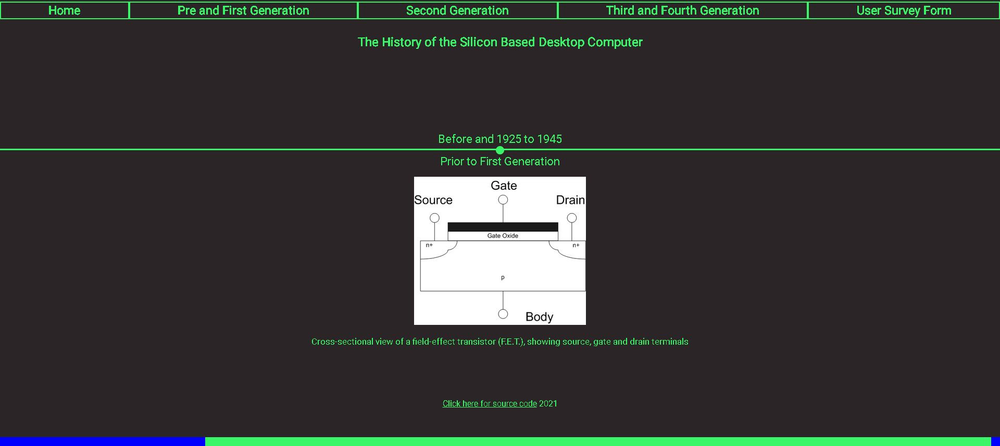
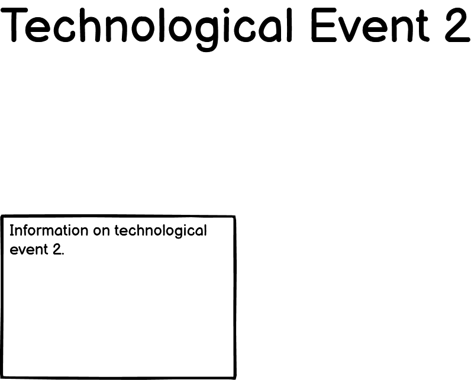
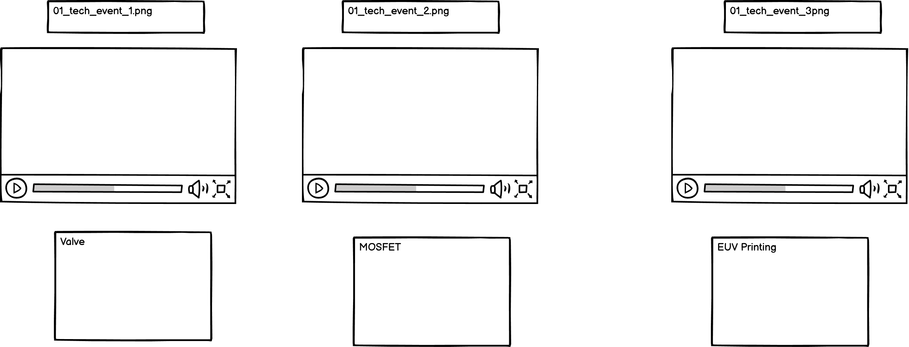
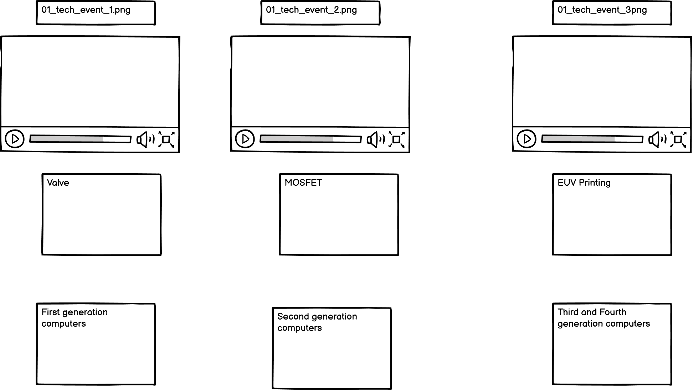
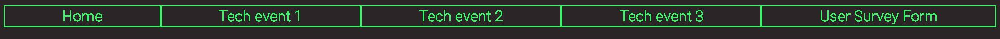
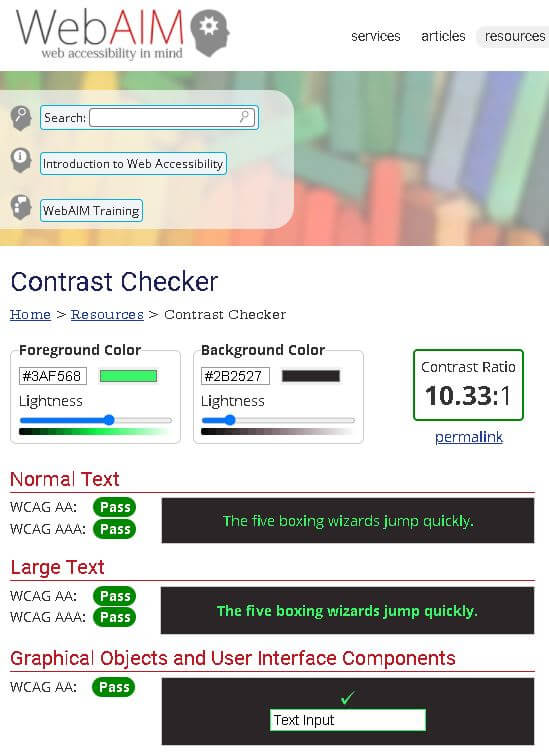
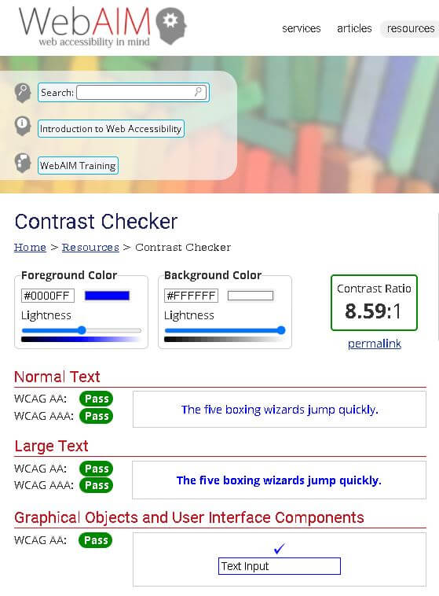
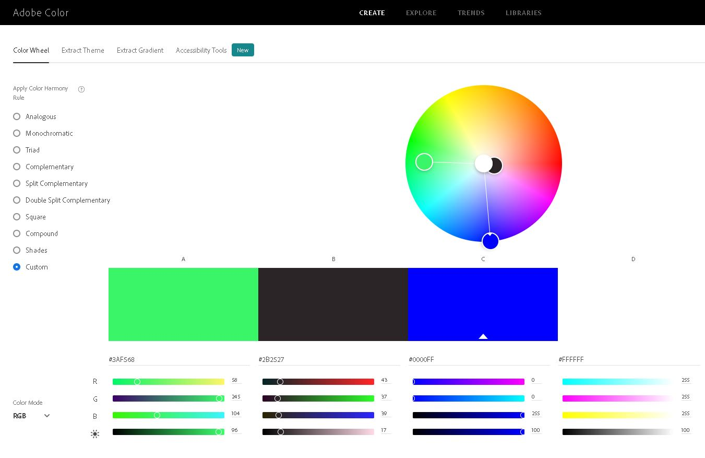
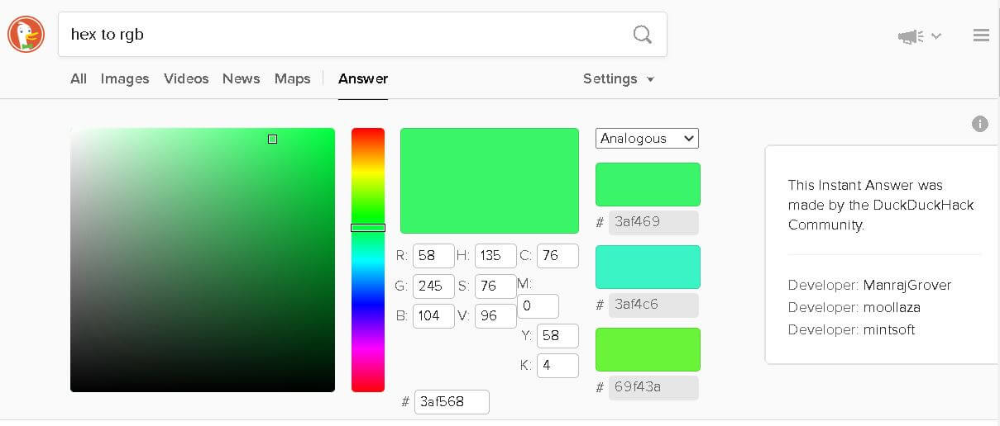
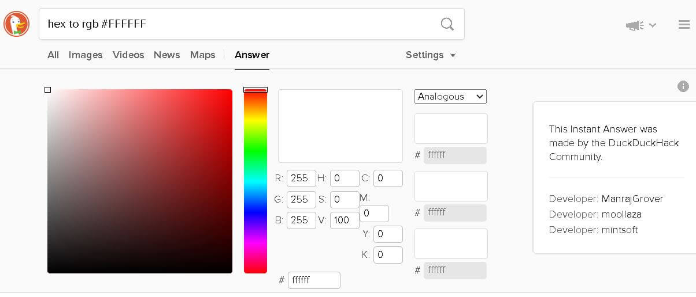

# Portfolio_Project_1
 The History of the Silicon Based Desktop Computer

## Overview of Project
Developing a website on the conventional desktop computer using HTML5 and CSS3.  This project goes through about a century of progress bringing us up to today.  This includes early work on field effect transistors.  That led to work on other transistors including the Bipolar Junction Transistor, collectively caled the first generation computers.  This in turn led to a breakthrough giving MOSFET transistors or metal–oxide–semiconductor field-effect transistors.  This era was the second generation.  The third generation was all about integrated circuits and the fourth generation is about microprocessors.  The fourth generation was from 1971 to 1980. However, as current silicon based desktop computers essentially use a very small scale version of these microprocessors, effectively we are still in the fourth generation of desktop computers.

This project was a good learning experience about css and html.  Challenges included modifying css style rules to target only specific sections of code without affecting others.  This was most difficult towards the end of the project.  Also, trying to position items on the page involved trail and error. Another challenge was ingtegrating different features together.

<a href="https://coder731.github.io/Portfolio_Project_1/" target="_blank">Image of Final Project</a>

<a href="https://coder731.github.io/Portfolio_Project_1/" target="_blank">Final Project Source Code</a>

## Features

The parts of the project

Value of feature to user

who website is for:
    - People who have an interest in the history of computers.

What they want to achieve
    - To get a quick overview of some of the main points of computer history, with some detail on interesting technologies.

How the project achieves this
    - This website uses CSS Style Sheets to present information on computer history in a way that is intuitive and creates a positive user experience.

### Existing features

- Wireframe in Balsamiq
- Navigation bar
- User survey form
- Horizontal timeline
- Vertical timelines

#### First Table of Wireframe Rough Plan Sketch made in using Balsamiq: 
<table>
    <tr>
        <td></td>
        <td></td>
        <td></td>
        <td></td>
        <td></td>
    </tr>
    <tr>
        <td>
Computer History Timeline Image Created with Balsamiq
</td>
        <td>
Tech Event 1
</td>
        <td>
Tech Event 2
</td>
        <td>
Tech Event 3
</td>
        <td>
User Survey Form Image
</td>
    </tr>
</table>

#### Second Table  of Wireframe Rough Plan made using Balsamiq: Videos ideas for tech event 1, 2 and 3
<table>
    <tr>
        <td></td>
    </tr>
    <tr>
        <td>
Image Created with Balsamiq of wireframe for videos proposed for webpages named tech event 1 2 and 3
</td>
    </tr>
</table>

#### Third Table of Wireframe Updated Plan made using Balsamiq: Content and video ideas for tech event 1, 2 and 3
<table>
    <tr>
        <td></td>
    </tr>
    <tr>
        <td>
Image Created with Balsamiq of wireframe for content and videos proposed for webpages named tech event 1 2 and 3
</td>
    </tr>
</table>

- There are 5 webpages on the site.
    - Home Page with Timeline spanning from 1925 to the 2021.
    - 3 pages dedicated to different eras of development of the Computer
        - pre_and_first_generation.html has two eras.
            - Prior to First Generation: Gives information on the field effect transistor (FET)
            - First Generation: Gives information on other transistors including the Bipolar Junction Transistor (BJT).
        - second_generation.html gives information on the key technology of the Second Generation of Computers, the MOSFET or metal-oxide-semiconductor field-effect transistor
        - third_and_fourth_generation.html has two eras.
            - Third Generation: Gives information on integrated circuits (ICs)
            - Fourth Generation: Gives information on the microprocessor and explains that while this era is listed as being from 1971 to 1980, current desktop computers still use microprocessors, although the technology has significantly advanced.  Also including is a piece on EUV Extreme Ultraviolet lithography, used in semi-conductor fabrication.  Finally, there is a link to a recent news article semiconductor shortages and how this is affecting not only desktop computers but a wide range of other technologies.
    - Survey Form to gather user feedback about the website.

- The website features a form element. This is a survey of how the user found the content and overall impression of the website.

The love-running guided website building project was used as a template.

- Button

- Matrix Color Scheme

- __Navigation Bar__

    - Featured on all five pages.
    - Responsive element.

#### Table  of Technologies Used
<table>
    <tr>
        <td></td>
        <td></td>
        <td></td>
        <td></td>
        <td></td>
        <td></td>
        <td></td>
        <td></td>
    </tr>
    <tr>
        <td>
HTML5
</td>
        <td>
CSS3
</td>
        <td>
Gitpod
</td>
        <td>
Git
</td>
        <td>
GitHub
</td>
        <td>
Stack Overflow
</td>
        <td>
W3Schools
</td>
        <td>
MDN Web Docs
</td>
    </tr>
</table>

### Features Left to Implement

- Tried to make a reflection like shine effect occur above the buttons on the navigation bar as well as below.  However, can only use a single before pseudo-class on a single element.
- Make buttons rotate, giving the illusion of shifting perspective when user moves mouse.
- Add light switch to switch from Matrix theme green font on black background to blue font on white background.
- Add audio to website, with image of an amplifier, switch, and sign asking if user wants to turn the sound on.
- Improve Compatibility: Remove flexbox as [not supported in Internet Explorer 10 as mentioned here.](https://www.w3schools.com/csS/css_align.asp)

#### Minor Features Left to Implement
- Make Buttons align center in Navigation bar.

##### Potentially useful tools for features
- Use list item appended to content id and [::marker pseudo element selector](https://developer.mozilla.org/en-US/docs/Web/CSS/::marker) as a CSS selector, as identified using Google Chrome Developer Tools Inspect Element.
    - Purpose: To style tech event 1 page content

## Testing

- Details of testing.

### Usability Testing

#### Consistency testing
A unified theme was needed to communicate that the website was about computer history.  So, the color scheme of green and black used in the 1999 Movie "The Matrix" was used.

#### Accessibility Standards
AAA requires a contrast ratio of 7:1.
[WCAG 2.1 Part 1.4.6 Contrast(Enhanced) - Level AAA](https://www.w3.org/WAI/WCAG21/quickref/)

#### Visibility Testing
For contrast, bright green on black rated well.

As a secondary color combination, white and light blue were too low contrast.
So, blue color was deepened.

### Validator Testing

- HTML
- [W3C validator](https://validator.w3.org/nu/?doc=https%3A%2F%2Fcode-institute-org.github.io%2Flove-running-2.0%2Findex.html)

CSS
- [(Jigsaw) validator](https://jigsaw.w3.org/css-validator/validator?uri=https%3A%2F%2Fvalidator.w3.org%2Fnu%2F%3Fdoc%3Dhttps%253A%252F%252Fcode-institute-org.github.io%252Flove-running-2.0%252Findex.html&profile=css3svg&usermedium=all&warning=1&vextwarning=&lang=en#css)

## User Experience
[By default](https://www.w3schools.com/jsref/prop_anchor_target.asp), internal website pages open on same page for the user, in order to avoid cluttering up browser with many tabs when moving around the website.

### Accessibility
High Contrast

## Browser Compatibility
- Box-shadow inset parameter not used, as only partially supported on Internet Explorer 9.
- Browser Compatibility: inset not used as shorthand for positioning top right bottom left as no support for functionality in Edge, Internet Explorer, Opera Android or Samsung Internet. 
- Browser Compatibility: hsl CSS property, alpha parameter: Internet Explorer Browser does not support alpha parameter in hsl hue staturation lightness property in CSS Stylesheets.

## Color Scheme
- Matrix Green on Black has a contrast ratio of 10.33:1, which exceeds the 7:1 ratio specification for [W3C Web Accessibility Initiative (WAI).](https://www.w3.org/WAI/)

 
#### Figure above shows results of color accessibility check for high contrast green font on black background color combination

#### Figure above shows results of color accessibility check for high contrast blue font on white background color combination

#### Figure above shows green, black, blue and white colors on Adobe Color wheel

#### Figure above shows green used in Matrix color theme

#### Figure above shows black used in Matrix color theme

#### Figure above shows blue used in Secondary color theme

#### Figure above shows white used in Secondary color theme

## Bugs

### Fixed Bugs 
Bug: Unstyled Home Button (Resolved)
- Home button on Navigation bar on Home page was not being styled by CSS.
Cause:
- The button id deleted from anchor for home page in Navigation bar in error.
Fix:
- The button id reinstated to anchor for home page in Navigation bar.

Bug: Bulleted Navigation bar (Resolved)
(Note: See also nav Bug 2 [here](#bullet_nav_bug_2))
Since the addition of unordered list and list item tags to Navigation bar on home page:
- Bullets are present to the left of buttons
Cause:
- Unordered list and list item tags.
Fix:
- Add bulletless class selector rule to CSS stylesheet with list-style property set to a value of none.
- Add bulletless class to list items on home page.

Bug: Vertical Navigation bar (Resolved)
Since the addition of unordered list and list item tags to Navigation bar on home page:
- Navigation bar is displaying vertically not horizontally
Attempts:
- Tried setting text align to center in CSS to override user agent stylesheet setting text align to webkit match parent in Browser.  However, when new setting was applied, this did not change the display.
Potential Solutions:
- Use card, instead of Unordered List.  Detail to be added.
Fix:
- Use inline-block value for display property in CSS rule targeting list item element in CSS Stylesheet

##### File name in file path unchangeable Bug (Resolved)
- Problem:
    - Detection: The following images were not displaying in README
                 in "First Table of Wireframe Rough Plan Sketch made in using Balsamiq:"
            pre_and_first_generation.png
            second_generation.png
            third_and_fourth_generation.png
    - Cause:
        - files not found for given href and src values
      - Root Cause:
        - Renaming the files does not seem to affect the name in the path the system uses to refer to the files.
    - Solution (Workaround):
        - Changed href and src values back to original values
        - Refer to deleted version of path in commit b560138c5da5bc558a0fbd5ffe5cfe98ec6ac308
            for original values used for href and src, featuring Capitalisations in file names
Solution: renamed files and issue resolved. (Had to copy files into a folder outside of the git repository delete and commit the images and add the images.  So, from git or bash perspective the files being added were new so no discrepancies between old and new file extension cases.)

##### File Extension Name Bug (Resolved)

###### Some images are named with capitalised .JPG endings.
- To try and address this, the ending was amended to lowercase, .jpg in keeping with the rest of the .jpg files.
- However, when the links were updated to .jpg they did not work.
- It emerged that even though the file was renamed to .jpg, the system stil refered to them as .jpg
- In the interest of simplicity, the files were reverted to the orignal .JPG extension.
    - Note: Images are hex_to_rgb_hash3af568.JPG hex_to_rgb_hash2b2527.JPG and nav_bar_image.JPG
Solution: Renamed these files from .JPG to .jpg and this issue resolved itself. (Had to copy files into a folder outside of the git repository delete and commit the images and add the images.  So, from git or bash perspective the files being added were new so no discrepancies between old and new file extension cases.)

##### Potential Cause for File Extension Name Bug and File name in file path unchangeable Bug (Resolved)
- Potentially, changing the file names or file paths through the Windows system does not change the Linux file paths in the same way.

##### Navigation bar displays in regular font on home page but bold on other pages (Resolved)
Solution: Adjusted font in stylesheet.

#### Debugged

##### Home page Bugs

###### Navigation bar Bugs (Resolved)
Bug: Partial width Navigation bar
Before the addition of unordered list and list item tags:
- Navigation bar was not stetching fully horizontally across screen.
Information Gathering:
- Set nav element and unordered list element to orange in turn.  Both took up full width of screen.
- Set list element to orange, and it took up the width of a button on home page.
Potential Causes:
- Button class, button hover class, anchor element, or list item element could be preventing buttons from spreading across width of page.
- Document Object Model is not set correctly. 
- Browser default properties
- Some single property is set wrong or inherited preventing full width.
Attempts:
- Tried setting width to different percentages, however these did not take into account different text widths.
- Other than using new units for width like view width, with potential Backward Compatibility issues, there does not seem to be a way to set font to a percentage of screen width.
- Added orange and blue background color to body element in home page.  This did not take effect in the Browser.

Potential Other Solutions:
- Use card, instead of Unordered List.  Detail to be added.
- Revisit HTML file
- Build second Nav bar for trial purposes
    - Use card approach mentioned above in trial Nav bar
    - Try using only Nav bar or only unordered list to see which is easier to make fill full width of pages
- CSS Grid
- 1 Dimentional alternative to CSS Grid
- Experiment with display, position, float, inline-block, block and inline values.
- Experiment with center, right, left, bottom, top values.
- Revisit solution search.
- Try using span element
- Look up div element
- Try using margin property
Resolution:
- Added div element as a container for the nav bar and added CSS Style rules for asterisk nav menu and nav links button.
- Resolved

###### Horizontal timeline and horizontal scroll slider bug (Resolved)
- Problem:
    - Detection:
        - timeline displays vertically on home page
    - Cause:
        - style2 css stylesheet not connecting to style home page
      - Root Cause:
        - rel attribute of CSS Stylesheet set to "alternate stylesheet" not "alternative stylesheet"
    -Solution:
        - Changed rel attribute of CSS Stylesheet from "alternate stylesheet" to "alternative stylesheet"
- Resolved

### minor Bugs (fixed and unfixed)

#### minor Bugs (fixed and unfixed) Unclassified
- Context: For vertical timeline merged with two columns.
- Problem: 
    - 2 section opening tags and two section closing tags within nested element tree.
    - Only one set is coupled together by system.
- Cause: 
    - Second section opening tag does not close before the containing unordered list element, inside the first opening Section tag, closes.
    - So, after the unordered list nested inside the first opening section element closes, the second opning Section tag nested in the unordered list seems closed off like a local variable within the unordered list.
    - Therefore, when first Section closing tag appears, since the most recent Section tag is not visible so to speak, due to being nested in the unordered list, the system pairs the aforementioned first Section closing tag with the first Section closing tag.
    - A second Section closing tag comes after this first, now paired Section closing tag; however, the aforementioned second Section closing tag is unpaired.
    - This is because the first opening Section tag is now paired with the first Section closing tag; and the second Section closing tag is not visible, due to being "locked" it seems inside the unordered list.
- Root Cause:
    - Although [this reference](https://www.adobepress.com/articles/article.asp?p=1179145&seqNum=3) is for XML it illustrates a similar problem to that experienced here with highlighting a right and a wrong approach to closing nested elements in HTML.
- Solution: Second Section element was brought outside nested unordered list, allowing both opening Section tags to pair with both closing Section tags.
    - Original incorrect, problematic Section tag order, including unordered list: open (unordered list open) OPEN (unordered list close) close CLOSE.  Where, OPEN and CLOSE are unpaired.
    - Final correct Section tag order, showing nested unordered list: open open (unordered list) close close.
- General take away rule of thumb: Nested element must close before parent element.

##### minor Debug (asterisk selector, zero padding, bullets and numbering, list related elements, indented nav bar minor Bug) 

###### Shorter name: asterisk padding bullet list indent nav Bug: "bullet nav Bug 2" 
- (Note: No bullet nav Bug 1, as it was slightly different for "Bug: Bulleted Navigation bar (Resolved)"). See [Fixed Bugs](#fixed_bugs).
- In style css, asterisk selector with padding set to zero was preventing bullets and numbers in unordered and ordered lists from being displayed.
- However, removal of this declaration makes nav bar indent on all pages.
- Potentially, could make a more specific selector than asterisk, which selects all elements, to set padding to zero in most elements while avoiding all elements related to lists: unordered list, ordered list, and list item elements.
    - However, ideally this would not affect the nav bar, or any other elements now being styled by the asterisk selector.
    - To pursue this line of debugging, could try to find out and list all the elements which are styled by asterisk.
        - Could potentially use Google Chrome Developer Tools Inspect Element.
- For the purpose of moving on with adding text content to the website, the nav bar may temporarily need to be left indented, to allow bullet point lists.
- Next Steps:
    - Replace asterisk selector with nav bar Selector.
    - Check which, if any, parts of site change.
    - Add duplicates of rule changing selector as needed to include more elements in order to undo these changes.
    - If unfixed by this approach potentially revert to asterisk selector and modify or try a different approach.

#### minor Bugs Fixed
##### Right align text in left column Bug (Resolved)
- Scenario: Adding and merging vertical timeline and two columns with each other and pre_and_first_generation.html.
    - Trying to right align text in left column
- Problem: Text aligning half way across left column not towards right of column.
- Why was this a problem: Verticaly timeline runs down the center of the page and years (on the left) need to be close to this line (to the right of the left column).
- Debugging: Drew out element tree and tried alternatively using different selectors in element tree with same declaration
    - Used Inspect Element on Browser
    - Adjusted colors of different elements
        - Recorded how colored elements in question appeared by color, then related this back to selector in CSS stylesheet and finally back to element in HTML.
- Cause: The same column class was targetting multiple elements in left and right columns and at different points in the element tree.
- Solution: created numbered column classes as needed.

##### Padding missing on vertical timeline Bug
- Problem: Padding not showing between right aligned text in left column and bullet point used as time point.
- Debugging: Added colors to elements and same padding declaration to different selectors
- Solution: It was necessary to target the inner elements nested in the element tree. By process of elimination narrowed it down to two rules and picked the one which set padding correctly.

#### minor Bugs Unfixed

#### minor Bugs Unfixed Using Workaround

##### Multiple section tags in vertical list merged with two columns Bug
- Scenario: Wrapping section opening and closing tags around merged vertical timeline with two columns in pre_and_first_generation.html 
- Problem: Content of second time point aligns left when merged vertical timeline with two columns is wrapped in section tags.
- Workaround: Left merged vertical timeline with two columns without section tag wrapping.
- Potential Cause: Enclosing section tags within each other may be problematic if not nested correctly.
    - If section closing tag for first section is supposed to come first, this will probably not be read this way by the system.
    - This may result in unexpected behaviour of site.
- [Reference on the use of section elements](https://blog.teamtreehouse.com/use-html5-sectioning-elements)
- It appears that using section tag for timeline means section cannot be used to contain timeline.

### Unfixed Bugs

#### Unfixed Using Workaround

## Deployment

process to deploy on GitHub.

Live Link:

## Media

- photos
- images
    - images online
        - [The Matrix](https://external-content.duckduckgo.com/iu/?u=https%3A%2F%2Ftse4.mm.bing.net%2Fth%3Fid%3DOIP.SmUcZE7l8Du70D59UMg1_wHaGo%26pid%3DApi&f=1)
    - images in assets>images
        - blue_white_color_combination.jpg
        - color_contrast_check_matrix.png
        - final_project.jpg
        - green_black_blue_white_colors.jpg
        - hex_to_rgb_hash0000FF.jpg
        - hex_to_rgb_hash2b2527.jpg
        - hex_to rgb_hash3af568.jpg
        - hex_to_rgb_hashFFFFFF.jpg
        - matrix_image.jpg
        - nav_bar_image.jpg
        - pre_and_first_generation.png
        - QR_Code_for_Further_Reading_First_Generation.png
        - second_generation.png
        - third_and_fourth_generation.png
        - time_line_sketch.png
        - user_survey_form.png
        - wireframe_for_content.png
        - wireframe_for_videos.png

## Reference Sources
- Here are reference sources used in the project.

##### Reference Sources / Readme / Image Alignment
- [Putting two images on the same line by skipping line break](https://stackoverflow.com/questions/49633290/how-to-stack-images-horizontally-in-readme-md)

- [Display a Table in Readme](https://stackoverflow.com/questions/24319505/how-can-one-display-images-side-by-side-in-a-github-readme-md)

- [Using Span  W3Schools reference](https://www.w3schools.com/tags/tag_span.asp)

##### Reference Sources / Readme / Markdown

- [Markdown text alignment using the center tag](https://stackoverflow.com/questions/14051715/markdown-native-text-alignment)

- [Markdown inline style for image alignment](https://stackoverflow.com/questions/255170/markdown-and-image-alignment)

- How to use links in README [Link to Pages](https://docs.readme.com/docs/linking-to-pages)

###### Internal links to navigate README
- [How to link to part of the same document in Markdown?](https://stackoverflow.com/questions/2822089/how-to-link-to-part-of-the-same-document-in-markdown)
- Used this to add anchor element(s) to Heading(s) (and possibly other components) in README, to allow for internal links. See Comment by 
[vgavro](https://github.com/vgavro) on this site: [Support internal links in markdown long_descriptions](https://github.com/pypa/readme_renderer/issues/169)

### HTML

#### Non Navigation bar HTML

##### Reference Sources / All HTML Pages

Use unordered list element with list item elements for each anchor element to make navigation bar stretch across page.
- [how to make navigation bar stretch across the page (HTML)](https://stackoverflow.com/questions/16629835/how-to-make-navigation-bar-stretch-across-the-page-html)

- [How To Make Navigation Bar Stretch Across The Page](https://www.aurigait.com/blog/how-to-make-navigation-bar-stretch-across-the-page/)

- [CSS Lists ](https://www.w3schools.com/CSS/css_list.asp)

- [HTML Lists ](https://www.w3schools.com/HTML/html_lists.asp)

- Using internal HTML page links [How do I link to part of a page? (hash?)](https://stackoverflow.com/questions/2835140/how-do-i-link-to-part-of-a-page-hash)

##### Reference Sources / HTML on Home Page

###### audio
- How to play audio in a html page. [HTML Audio ](https://www.w3schools.com/html/html5_audio.asp)

- [Html 5 audio tag custom controls?](https://stackoverflow.com/questions/7638754/html-5-audio-tag-custom-controls)

- [Is it possible to style html5 audio tag?](https://stackoverflow.com/questions/4126708/is-it-possible-to-style-html5-audio-tag)

- [mediaControls.css](https://chromium.googlesource.com/chromium/blink/+/72fef91ac1ef679207f51def8133b336a6f6588f/Source/core/css/mediaControls.css?autodive=0%2F%2F%2F)

###### Content / head element

- [X-UA-Compatible Tag, older Microsoft Browser support](https://stackoverflow.com/questions/6771258/what-does-meta-http-equiv-x-ua-compatible-content-ie-edge-do)

- [Defining document compatibility](https://docs.microsoft.com/en-gb/previous-versions/windows/internet-explorer/ie-developer/compatibility/cc288325(v=vs.85))

###### Content / body element
- [How to indent a header?](https://stackoverflow.com/questions/33541600/how-to-indent-a-header)

##### link

###### link
- [link: The External Resource Link element](https://developer.mozilla.org/en-US/docs/Web/HTML/Element/link#attr-title)
- The HTML a tag defines a hyperlink [HTML Links ](https://www.w3schools.com/html/html_links.asp)

###### link types
- Describes link types using a, area, form and link [Link types](https://developer.mozilla.org/en-US/docs/Web/HTML/Link_types)

##### article
-Used in selector at the start of first CSS Stylesheet [article tag ](https://www.w3schools.com/TAGS/tag_article.asp)

#### HTML Elements

###### Self Closing HTML elements
- [Self-Closing Tags in HTML](https://www.tutorialmines.net/self-closing-tags-html/)

###### anchor element
- [a The Anchor element](https://developer.mozilla.org/en-US/docs/Web/HTML/Element/a)
- The HTML a tag defines a hyperlink [HTML Links ](https://www.w3schools.com/html/html_links.asp)

##### HTML Attributes

###### anchor element target attribute
- [HTML anchor target Attribute ](https://www.w3schools.com/tags/att_a_target.asp)

###### The id attribute
- [The id attribute ](https://www.w3schools.com/htmL/html_id.asp)

###### The rel Attribute
- [HTML link rel Attribute ](https://www.w3schools.com/tags/att_link_rel.asp)

#### Reference Sources / Navigation bar / Bug

##### Reference Sources / Navigation bar / Bug / Vertical
- Potential solution to Bug with unordered list making Navigation bar display vertically. Use display property, with a value of inline-block to set navigation bar horizontal. [horizontal nav bar / unordered list](https://stackoverflow.com/questions/33395003/horizontal-nav-bar-unordered-list)

##### Reference Sources / Navigation bar / Bug / Partial Width
- Can have more than one Navigation bar. Used temporarily for debugging Partial width Navigation bar Bug. [Is it possible to add multiple CSS navigation bars on one HTML page and if yes, how?](https://www.quora.com/Is-it-possible-to-add-multiple-CSS-navigation-bars-on-one-HTML-page-and-if-yes-how?share=1)
- [Making the nav bar span the width of the page](https://stackoverflow.com/questions/29538290/making-the-nav-bar-span-the-width-of-the-page)
- [CSS Margins](https://www.w3schools.com/Css/css_margin.asp)

### CSS

#### Reference Sources / CSS

##### Reference Sources / style.css file
- [Inline CSS formatting best practices - Two questions](https://stackoverflow.com/questions/5732486/inline-css-formatting-best-practices-two-questions)
- [CSS Syntax ](https://www.w3schools.com/Css/css_syntax.asp)
- First source using :root to declare css variables early in CSS stylesheet. [CSS variable](https://www.youtube.com/watch?v=6xNcXwC6ikQ)
- Second source using :root to declare css variables early in CSS stylesheet. [CSS variables in MDN Web Docs](https://developer.mozilla.org/en-US/docs/Web/CSS/:root)
- Third source using :root. [CSS root Selector ](https://www.w3schools.com/cssref/sel_root.asp)

###### Using CSS Box sizing
- First source using box sizing in CSS. [Reset box sizing](https://www.youtube.com/watch?v=6xNcXwC6ikQ)
- Second source using box sizing in CSS. [Box Sizing](https://css-tricks.com/box-sizing/)
- Third source using box sizing in CSS. [CSS Box Sizing,  W3Schools article](https://www.w3schools.com/css/css3_box-sizing.asp)
- Fourth source using box sizing in CSS. [CSS Box Sizing Property,  W3Schools article](https://www.w3schools.com/CSSref/css3_pr_box-sizing.asp)

###### Pseudo-elements in CSS
- CSS Pseudo-elements [Before and After pseudo elements explained - part one: how they work](https://www.youtube.com/watch?v=zGiirUiWslI&list=PL4-IK0AVhVjPBX_HelwDlNsTiyr2YGSBw&ab_channel=KevinPowell)
- [CSS Pseudo-elements ](https://www.w3schools.com/CSS/css_pseudo_elements.asp)

###### Using the "before" selector in CSS
- Source 1 for CSS before selector. [CSS ::before Selector,  W3Schools article](https://www.w3schools.com/cssref/sel_before.asp)
- Source 2 for CSS before selector. [CSS ::before selector](https://developer.mozilla.org/en-US/docs/Web/CSS/::before)

###### Using the "after" selector in CSS
- Source 1 for CSS after selector. [CSS ::after Selector,  W3Schools article](https://www.w3schools.com/cssref/sel_after.asp)
- Source 2 for CSS after selector. [CSS ::after selector](https://developer.mozilla.org/en-US/docs/Web/CSS/::after)

###### Can only target a single HTML element with a single id selector
- Short answer? No because the browser will only render the first one. [Can a HTML element have multiple unique ID attributes? [duplicate]](https://stackoverflow.com/questions/16936132/can-a-html-element-have-multiple-unique-id-attributes)

###### Can only target a single HTML element with a single before pseudo-element 
- In CSS2.1, an element can only have at most one of any kind of pseudo-element at any time. (This means an element can have both a :before and an :after pseudo-element — it just cannot have more than one of each kind.) [Can I have multiple :before pseudo-elements for the same element?](https://stackoverflow.com/questions/11998593/can-i-have-multiple-before-pseudo-elements-for-the-same-element)

###### Pseudo-classes
- A CSS pseudo-class is a keyword added to a selector that specifies a special state of the selected element(s). For example, :hover can be used to change a button's color when the user's pointer hovers over it. [Pseudo-classes](https://developer.mozilla.org/en-US/docs/Web/CSS/Pseudo-classes)

###### CSS position Property
- [CSS position Property ](https://www.w3schools.com/cssref/pr_class_position.asp)
- Although there is support in new inset property, this was avoided for Browser Compatibility. [(No) CSS shorthand for positioning](https://stackoverflow.com/questions/10855276/css-shorthand-for-positioning)
- New inset property, which acts like shorthand. Not used for Browser Compatibility. [inset](https://developer.mozilla.org/en-US/docs/Web/CSS/inset#browser_compatibility)

###### CSS left property
- The left CSS property pertains to the horizontal position of an element. [left](https://developer.mozilla.org/en-US/docs/Web/CSS/left)

###### CSS transform
- If perspective() is one of multiple function values, it must be listed first. [transform](https://developer.mozilla.org/en-US/docs/Web/CSS/transform)
    - The perspective() CSS function defines a transformation that sets the distance between the user and the z=0 plane [perspective()](https://developer.mozilla.org/en-US/docs/Web/CSS/transform-function/perspective())
    - [CSS Transform: Rotating a 3D object with perspective based on mouse position](https://www.armandocanals.com/posts/CSS-transform-rotating-a-3D-object-perspective-based-on-mouse-position.html)
    - The rotate CSS function [rotate()](https://developer.mozilla.org/en-US/docs/Web/CSS/transform-function/rotate())
    - The rotateX CSS function defines a transformation that rotates an element around the horizontal axis.[rotateX()](https://developer.mozilla.org/en-US/docs/Web/CSS/transform-function/rotateX())

###### CSS filter Property
- CSS Syntax for filter Property includes setting value to blur [CSS filter Property ](https://www.w3schools.com/CSSref/css3_pr_filter.asp)

###### CSS blur()function
- The blurCSS function applies a Gaussian blur to the input image. [blur](https://developer.mozilla.org/en-US/docs/Web/CSS/filter-function/blur())

###### CSS hover Selector
- [CSS hover Selector ](https://www.w3schools.com/cssref/sel_hover.asp)

###### Using Asterisk selector in CSS
The CSS Asterisk selector * selects all HTML elements.
- First source for asterisk selector. [CSS asterisk * selector](geeksforgeeks.org/what-is-the-use-of-asterisk-selector-in-css/)
- Second source for asterisk selector. [CSS asterisk * selector](https://stackoverflow.com/questions/1204275/what-does-an-asterisk-do-in-a-css-selector)
- Third source for asterisk selector. [CSS asterisk * selector ](https://www.w3schools.com/cssref/sel_all.asp)

###### Using CSS padding property
- [CSS padding Property ](https://www.w3schools.com/CSSref/pr_padding.asp)

###### Using rem units
- In CSS, the size unit rem stands for root element. [Using rem versus em size units in CSS](https://stackoverflow.com/questions/13941275/how-does-rem-differ-from-em-in-css)
- [Rem in CSS: Understanding and Using rem Units](https://www.sitepoint.com/understanding-and-using-rem-units-in-css/)

###### Cursor Pointer
- Using a CSS declaration with cursor property set to a value of pointer, to display pointing hand in CSS. [Cursor property set to value of pointer ](https://www.w3schools.com/csSref/pr_class_cursor.asp)
    - [Practice page for cursor set to pointer in CSS ](https://www.w3schools.com/csSref/tryit.asp?filename=trycss_cursor)

###### Embedding iframe element
-[Method of embedding a YouTube video: Go to video select SHARE > embed > copy the iframe element into your HTML](https://www.bitdegree.org/learn/how-to-embed-a-youtube-video)

###### Anatomy of a CSS Rule
- How to refer to the different parts of a CSS Rule. [Anatomy of a CSS Rule](https://ironion.com/blog/2015/06/12/anatomy-of-a-css-rule/)

##### Reference Sources style2 css file

##### CSS Background Image
- [CSS background image ](https://www.w3schools.com/css/css_background_image.asp)

###### CSS Center
- [CSS center vertical ](https://www.w3schools.com/howto/howto_css_center-vertical.asp)

- [How To Center or Align Text and Images on Your Webpage with HTML](https://www.digitalocean.com/community/tutorials/how-to-center-or-align-text-and-images-on-your-webpage-with-html)

##### Reference Sources / style3 css file
- [How to Center Text in CSS](https://blog.hubspot.com/website/center-text-in-css)

- [How TO - List Without Bullets](https://www.w3schools.com/howto/howto_css_list_without_bullets.asp)

##### Using CSS Grid

###### Single Grid
- [CSS Grid ](https://www.w3schools.com/css/css_grid.asp)
- Test page [Grid Layout ](https://www.w3schools.com/css/tryit.asp?filename=trycss_grid_layout_named)

###### Multi Grid
- [The Multi-Grid One-Page Layout](https://medium.com/@nikkipantony/multi-grid-one-page-layout-css-grid-6efefd537404)
- Put each grid inside section element containers [CodePen Home: CSS Multi-Grid One-Page Layout Experiment with CSS Grid, Flexbox and HTML5 Sections](https://codepen.io/nikkipantony/pen/vWgjBw)

##### Header and Footer

-  Yes, only 1 of each for each "section" of your page. [html5: using header or footer tag twice?](https://stackoverflow.com/questions/4837269/html5-using-header-or-footer-tag-twice)

##### Reference Sources / CSS Center Header

###### CSS flex Property
- [CSS flex Property ](https://www.w3schools.com/cssref/css3_pr_flex.asp)
- [flex](https://developer.mozilla.org/en-US/docs/Web/CSS/flex)

###### CSS flex direction Property
- [CSS flex-direction Property ](https://www.w3schools.com/cssref/css3_pr_flex-direction.asp)

###### CSS align items Property
- [CSS align-items Property](https://www.w3schools.com/CSSref/css3_pr_align-items.asp)

##### Reference Sources / CSS h1

###### CSS h1 / Override Google Chrome Developer Tools user agent stylesheet / margin

- Using CSS properties from user agent stylesheet to create rule
native to project stylesheet that overrides these properties,
to increase margin at top of webpage
- This gives instructions from December 2018.  Chrome was on version 72 [and is now on version 91](https://chromereleases.googleblog.com/).  So, there have been changes in the interim.  This includes changes to the instructions given.  Instead of the Select automatically checkbox, now there is a Use Browser Default checkbox.  Also, as there is an option to set different devices. [Override the user agent string](https://developer.chrome.com/docs/devtools/device-mode/override-user-agent/)
- [What is a user agent stylesheet?](https://stackoverflow.com/questions/12582624/what-is-a-user-agent-stylesheet)

##### CSS Best Practice

###### How to Structure CSS
- [Organizing your CSS](https://developer.mozilla.org/en-US/docs/Learn/CSS/Building_blocks/Organizing)
- [Use multiple css stylesheets in the same html page](https://stackoverflow.com/questions/4284499/use-multiple-css-stylesheets-in-the-same-html-page)

###### CSS multiple classes per element
- [multiple classes on single element html [closed]](https://stackoverflow.com/questions/17366432/multiple-classes-on-single-element-html)

##### CSS links
- four states of any link. a: link a:visited a:hover a:active [How To Add Links In CSS](https://cssdeck.com/blog/how-to-add-links-in-css/)

##### Reference Sources / style.css file / Color

###### Color HEX
- [How to use HEX color in CSS ](https://www.w3schools.com/colors/colors_hexadecimal.asp)

###### CSS Color Wheel
- [Adobe color-wheel](https://color.adobe.com/create/color-wheel)
###### Colors - Tool for selecting multiple colors for website. [Adobe Color Wheel](https://color.adobe.com/create/color-wheel)
- [Color design theory](https://blog.hubspot.com/marketing/color-theory-design)
- Color wheel calculator tool for picking website. [Sessions College](https://www.sessions.edu/color-calculator-results/?colors=2b2527,22f0e2,1d99ff,32d16c,3af568,ffffff)
- Tool for checking Accessibility of Color combination chosen for website. [Accessibility of color combination Tool](https://material.io/resources/color/#!/?view.left=1&view.right=1&primary.color=ffffff&secondary.color=2b2527&primary.text.color=1d99ff&secondary.text.color=3af568)
- Used this site to check if font/background combinations are above 7:1 contrast ratio.[Web Accessibility In Mind WebAIM](https://webaim.org/resources/contrastchecker/)
- [Add inline style to h2 element to center content](https://stackoverflow.com/questions/41439730/how-to-center-a-h2)

###### CSS HSL Colors
- [CSS HSL Colors ](https://www.w3schools.com/css/css_colors_hsl.asp)
-  Browser Compatibility: hsl CSS property, alpha parameter: Internet Explorer Browser does not support alpha parameter in hsl hue staturation lightness property in CSS Stylesheets [hsl()](https://developer.mozilla.org/en-US/docs/Web/CSS/color_value/hsl())
- [CSS hsl() Function ](https://www.w3schools.com/csSref/func_hsl.asp)
- [Colors HSL ](https://www.w3schools.com/colors/colors_hsl.asp)

###### CSS text shadow
- How to use text shadow in CSS Stylesheets. CSS Syntax uses horizontal shadow, vertical shadow, blur radius, and color parameters. [CSS text-shadow Property ](https://www.w3schools.com/cssref/css3_pr_text-shadow.asp)

###### CSS box shadow
- Browser Compatibility: Only Partial Support in Internet Explorer 9 for Box shadow inset parameter. [box-shadow](https://developer.mozilla.org/en-US/docs/Web/CSS/box-shadow)
- [CSS box-shadow Property ](https://www.w3schools.com/CSSref/css3_pr_box-shadow.asp)
- [CSS Box Shadow ](https://www.w3schools.com/css/css3_shadows_box.asp)
- [box-shadow](https://css-tricks.com/almanac/properties/b/box-shadow/)

##### Fonts

###### CSS Font Size
- [CSS Font Size ](https://www.w3schools.com/css/css_font_size.asp)

###### Google Fonts
- Using Google fonts in a few of my pages and hit a wall when trying to use variations of a font.  Importing three faces, Normal, Bold, ExtraBold via the link tag.  How to use the variants of the font in my CSS. Answer: They use regular CSS.  Just use regular font family property. Now decide what "weight" the font should have by adding font weight property (values in parentheses) as needed for semi-bold, for bold (700), for extra bold (800). [Specifying Style and Weight for Google Fonts](https://stackoverflow.com/questions/7256065/specifying-style-and-weight-for-google-fonts#7256119)

###### How to use Google Fonts
- How to use Google Fonts [CSS Google Fonts ](https://www.w3schools.com/csS/css_font_google.asp)
- [Roboto Google font code](https://fonts.google.com/specimen/Roboto)

###### Open Sans Google Font
- [Open Sans Google font code](https://fonts.google.com/specimen/Open+Sans?query=Open+sans)

##### Responsive Design
- [Responsive design](https://developer.mozilla.org/en-US/docs/Learn/CSS/CSS_layout/Responsive_Design)

###### CSS media Rule
- [CSS media Rule ](https://www.w3schools.com/cssref/css3_pr_mediaquery.asp)

###### Nav bar vertical
- Center Links & Add Borders. [CSS Vertical Navigation Bar ](https://www.w3schools.com/Css/css_navbar_vertical.asp)
    - Block elements take up the full width by default.

##### CSS selectors
- Combining Multiple CSS Selectors [Multiple Class / ID and Class Selectors](https://css-tricks.com/multiple-class-id-selectors/)

### Timeline
- [How TO - Timeline ](https://www.w3schools.com/howto/howto_css_timeline.asp)

- [Horizontal timeline in pure css](https://stackoverflow.com/questions/21916615/horizontal-timeline-in-pure-css)

### Scroll bar
- Used to add button colors to scroll bar used in horizontal scroling timeline on home page. [::-webkit-scrollbar](https://developer.mozilla.org/en-US/docs/Web/CSS/::-webkit-scrollbar)

### Reference Sources / Non-content support material

#### Content / Git

##### Content / Git / Commit Messages

###### Git: Methods of adding Header and Message to git commit messages
- How to use console VIM editor in Integrated Development Environment to add git commit messages with line breaks. [Learning How to Git: Creating a (Longer) Commit Message](https://haydar-ai.medium.com/learning-how-to-git-creating-a-longer-commit-message-16ca32746c3a)
- How to add a line break to a git commit message from the terminal, using "here document". [How to commit with a header and a message in git from the command line](https://stackoverflow.com/questions/5064563/add-line-break-to-git-commit-m-from-the-command-line)
    - Here document is a file literal or input stream literal.  It behaves as a separate file. It originates in Unix shell and is found in Bash. [Here document](https://en.wikipedia.org/wiki/Here_document)
        - EOF stands for End Of File. [EOF](https://acronyms.thefreedictionary.com/EOF)
- Use git diff to transform current directory into a git repository. [git init](https://github.com/git-guides/git-init)
- Explains chunks in git diff [git diff](https://www.toolsqa.com/git/git-diff/)
- Fourth item in numbered list under Combined diff format heading gives information on chunks. [git diff Documentation]https://git-scm.com/docs/git-diff#_combined_diff_format)
- [Best explanation of git diff git chunk header](https://www.atlassian.com/git/tutorials/saving-changes/git-diff)

###### Git: Adding Commit Messages
- Rule 7 Use commit message body to explain what and why not how. [How to COMMIT BETTER with GIT](https://youtu.be/Hlp-9cdImSM)

###### Git: How to open editor from terminal, why not to punctuate commit messages
- How to open default editor from terminal in Integrated Development Environment to write a git commit message. Also, reasons not to use punctuation marks. [How to Write Good Commit Messages in GitHub?
](https://www.geeksforgeeks.org/how-to-write-good-commit-messages-in-github/)
- Reason not to use commas in git commit messages. Also, if exporting git commit messages to csv, how to switch to semicolon delimitors instead of commas. This allows export of commit messages with commas, without messages splitting into different cells at each comma.  [How to escape commas inside commit title/subject in Git logs?](https://stackoverflow.com/questions/58907495/how-to-escape-commas-inside-commit-title-subject-in-git-logs)
###### Viewing GitHub Commits
- [How to view git commits on GitHub Repositories](https://stackoverflow.com/questions/65373797/where-can-i-see-the-commit-history-on-the-github-website)
- [Image (from stackoverflow link above) highlighting where to access git commits](https://i.stack.imgur.com/HjDQX.png)
###### Comparing Git Commits
- [Git: How to compare two different versions of a file](https://alvinalexander.com/photos/git-compare-two-different-versions-of-a-file/)
###### IDE Integrated Development Environment
- What does the abbreviation IDE stand for? [What Is an IDE? | Codecademy](https://www.codecademy.com/articles/what-is-an-ide)

##### Content / Vim
###### Set word wrap at End of Line
- How to set Vim to word wrap at the end of a line, for use in terminal to write commit messages. [Automatic word wrapping](https://vim.fandom.com/wiki/Automatic_word_wrapping)
- Hard wrap recommended at 72 characters for git commits using Vim. [How to wrap git commit comments?](https://stackoverflow.com/questions/2119942/how-to-wrap-git-commit-comments)

##### General notes
- No CSS in README with GitHub. [GitHub does not allow for CSS to affect README.md files](http://stackoverflow.com/questions/51956361/ddg#51956450)
- How to align images in Readme using HTML. [Center images in README](https://stackoverflow.com/questions/12090472/how-do-i-center-an-image-in-the-readme-md-on-github/62383408#62383408)
- [GitHub Repository on how to do an image in a README_using Markdown](https://github.com/alandtsang/README)
- [Anatomy of the html tag](https://clearlydecoded.com/anatomy-of-html-tag)
- Resource for Markdown. [R_Markdown](https://rmarkdown.rstudio.com/)

###### Images side by side in markdown
- [Stack two images horizontally in R_Markdown](https://community.rstudio.com/t/how-to-stack-two-images-horizontally-in-r-markdown/18941)

### Reference Sources by Issue

#### Center bullets of unordered list with text

- To make the bullet point center with the text in an unordered list: in the unordered list element, add list style position CSS property, set to a value of inside. [Center bullets of an unordered list with text](https://stackoverflow.com/questions/28977320/how-do-i-get-the-bullet-points-of-a-ul-to-center-with-the-text)
    - [list style position CSS property](https://developer.mozilla.org/en-US/docs/Web/CSS/list-style-position)

#### Vertical Timeline 2 Columns Merge
- [https://www.w3schools.com/css/css_text_align.asp](https://www.w3schools.com/css/css_text_align.asp)

#### Remove Bullet Point
- [How to remove bullets from a un-ordered list (ul) in Html](https://reactgo.com/remove-bullets-ul-html/)
- [CSS padding ](https://www.w3schools.com/csS/css_padding.asp)

## Media References

###### Matrix Color Scheme
- Matrix colors used as a theme for website. [Green and Black Colors taken from this image](https://www.mobygames.com/images/shots/l/369148-the-matrix-online-windows-screenshot-every-time-an-area-loads.jpg)

## Technologies Used

###### Image Compressors
- Default image compressor. [TinyPNG](https://tinypng.com/)
- Used any time TinPNG gave jfif file, which will not run in Integrated Development Environment. [JPEG_compressor](https://compressjpeg.com/)

## Templates Referenced

#### Templates Referenced / Readme
- [Template used for this Readme](https://github.com/lucyrush/readme-love-running/blob/master/media/love_running_nav.png)

- [love-running repository](https://github.com/Code-Institute-Solutions/love-running-2.0-sourcecode/tree/main/01-getting-set-up/01-getting-set-up)

- [git-pod-full-template](https://github.com/Code-Institute-Org/gitpod-full-template)

- CodeInstitute lessons on the Editor were used as a template for how to showcase technologies.  The technologies used in this project, are shown in this Readme file. [Creating a Webpage that showcases technologies used in a Project](https://github.com/Code-Institute-Solutions/Editor)

## W3Schools Educational Walkthrough Code Used

###### Custom Scrollbar
- Used for styling horizontal scroll bar for timeline on home page [How TO - Custom Scrollbar ](https://www.w3schools.com/howto/howto_css_custom_scrollbar.asp)

## Credits

### Credits / Content

- root body button and button hover CSS Rules taken from here. [CSS Neon Button Worked Example](https://www.youtube.com/watch?v=6xNcXwC6ikQ&ab_channel=KevinPowell)

- Used overflow property set to a value of hidden. [Making the nav bar span the width of the page](https://stackoverflow.com/questions/29538290/making-the-nav-bar-span-the-width-of-the-page)

- Used while debugging Nav bar Partial Width Bug.  This code was reproduced locally in a separate repository and then stripped down to find which elements were needed to fix the nav bar Partial Width bug.  The asterisk class with box sizing, zero margin, zero padding and font family properties was taken from 11:20 in video, as well as nav menu and nav links button classes taken from 19:04 in video.  This solved the Nav bar Partial width bug. [How to Make a Responsive Navigation Menu Navbar Using HTML, CSS, and Javascript Tutorial](https://www.youtube.com/watch?v=yFWAOzwovrQ&ab_channel=BrianDesign)

- Used for form and matrix background image generation. [gitpod-full-template](https://github.com/Code-Institute-Org/gitpod-full-template)

- Used for form and matrix background image generation. Signup Form Challenge 1 [Code Institute Project love running 2.0](https://github.com/Code-Institute-Org/love-running-2.0)
    - [Animation](https://github.com/Code-Institute-Solutions/love-running-2.0-sourcecode/tree/main/03-creating-the-hero-image/02-hero-image-animation)

- [Background zoom](https://github.com/Code-Institute-Solutions/love-running-2.0-sourcecode/tree/main/03-creating-the-hero-image/02-hero-image-animation)

- Merged Vertical timeline with 2 Columns.
    - [Vertical Timeline](https://freefrontend.com/css-timelines/)
        - [Vertical Timeline](https://codepen.io/mathiesjanssen/pen/ggeBKm)
    - [2 Columns](https://www.w3schools.com/howto/howto_css_two_columns.asp)
        - [W3Schools Try it](https://www.w3schools.com/howto/tryit.asp?filename=tryhow_css_two_columns)

### README

#### Internal Linking
- Used this to add anchor element(s) to Heading(s) (and possibly other components) in README, to allow for internal links. See Comment by 
[vgavro](https://github.com/vgavro) on this site: [Support internal links in markdown long_descriptions](https://github.com/pypa/readme_renderer/issues/169)

#### Credits Content Timeline

- [Horizontal Timeline](https://codepen.io/kundankumarmourya/pen/oKBMLe)

#### Credit Contents Scroll

- [CSS horizontal scroll](https://stackoverflow.com/questions/9925754/css-horizontal-scroll)

###### Multi Grid
Used section elements as containers to allow for multiple grids on home page.
- [The Multi-Grid One-Page Layout](https://medium.com/@nikkipantony/multi-grid-one-page-layout-css-grid-6efefd537404)
- Put each grid inside section element containers [CodePen Home: CSS Multi-Grid One-Page Layout Experiment with CSS Grid, Flexbox and HTML5 Sections](https://codepen.io/nikkipantony/pen/vWgjBw)

###### Center Header

- Three declarations were taken from this source.  These were used to center the header on the home page. [CodePen Home: CSS Multi-Grid One-Page Layout Experiment with CSS Grid, Flexbox and HTML5 Sections](https://codepen.io/nikkipantony/pen/vWgjBw)

#### Historical data sources
- Historical data source [History of computing hardware (1960s–present)](https://en.wikipedia.org/wiki/History_of_computing_hardware_(1960s%E2%80%93present)#Third_generation)

- [Computer - First Generation ](https://www.tutorialspoint.com/computer_fundamentals/computer_first_generation.htm)

- [History of the transistor](https://en.wikipedia.org/wiki/History_of_the_transistor)

### Credits / Media

- photos
- images
    - images online
        - [The Matrix](https://external-content.duckduckgo.com/iu/?u=https%3A%2F%2Ftse4.mm.bing.net%2Fth%3Fid%3DOIP.SmUcZE7l8Du70D59UMg1_wHaGo%26pid%3DApi&f=1)
        - [Matrix Background image](https://getwallpapers.com/collection/matrix-binary-code-falling-wallpaper)
- [Font Awesome](https://fontawesome.com/)
        - [Frown Face](https://fontawesome.com/v5.15/icons/frown?style=regular)
        - [Meh Face](https://fontawesome.com/v5.15/icons/meh?style=regular)
        - [Smiley Face](https://fontawesome.com/v5.15/icons/smile-beam?style=regular)
- video
    - Video on vacuum tube computers, [considered the first generation computer](https://en.wikipedia.org/wiki/History_of_computing_hardware_(1960s%E2%80%93present)#Third_generation). For video, please click here: [Computer History 1949 -1960 Early Vacuum Tube Computers Overview, History Project Educational](https://youtu.be/WnNm_uJYWhA?t=3)
    - Video on [How a MOSFET works](https://youtu.be/Bfvyj88Hs_o?t=1)
    - EUV
        - Video on [EUV. (Please click here for video)](https://youtu.be/oIiqVrKDtLc?t=363) 
            - or
        - [Extreme ultraviolet lithography used in computer chip printing. (Please click here for text description.)](https://en.wikipedia.org/wiki/Extreme_ultraviolet_lithography)