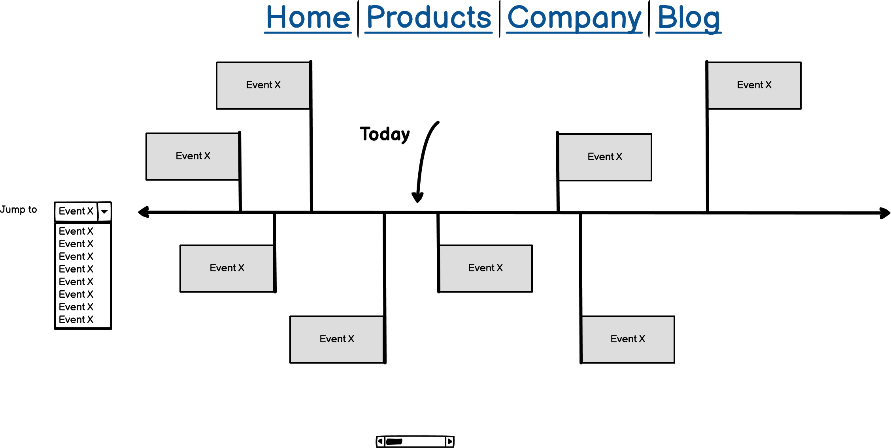
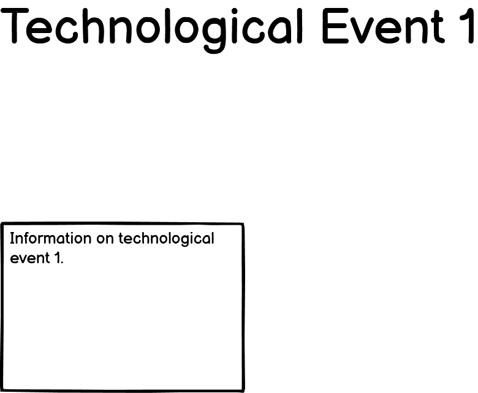
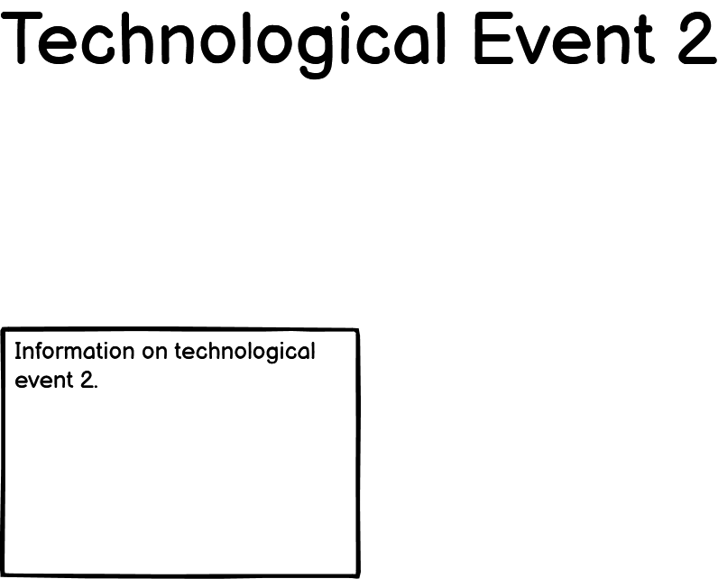
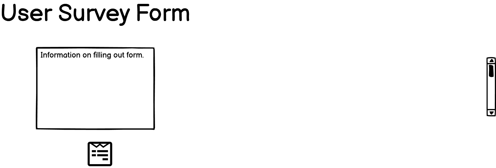

# Portfolio_Project_1
 The History of the Silicon Based Desktop Computer

## Overview of Project (2 paragraphs)
Developing a website on the conventional desktop computer using HTML5 and CSS3.

[Insert Picture of Final Project Simplest Version On Time Under Budget](insert website)

## Features

The parts of the project

Value of feature to user

who website is for:
    - People who have an interest in the history of computers.

What they want to achieve
    - To get a quick overview of some of the main points of computer history, with some detail on interesting technologies.

How the project achieves this
    - This website uses CSS Style Sheets to present information on computer history in a way that is intuitive and creates a positive user experience.

### Existing features

- Wireframe in Balsamiq

    #### Table  of Wireframe Rough Plan Sketch made in using Balsamiq
<table>
    <tr>
        <td></td>
        <td></td>
        <td></td>
        <td></td>
        <td></td>
    </tr>
    <tr>
        <td>
Computer History Timeline Image Created with Balsamiq
</td>
        <td>
Tech Event 1 Created Using Balsamiq
</td>
        <td>
Tech Event 2 Created Using Balsamiq
</td>
        <td>
Tech Event 3 Created Using Balsamiq
</td>
        <td>
User Survey Form Image Created Using Balsamiq
</td>
    </tr>
</table>

- There are 5 webpages on the site.
    - Home Page with Timeline
    - 3 Key technologies for the computer
    - Survey Form to gather user feedback about the website.

- The website features a <form> element. This is a survey of how the user found the content and overall impression of the website.

(Use love-running as template)

- Button

- Matrix Color Scheme

- __Navigation Bar__

    - Featured on all three pages.
    - Responsive element.

#### Table  of Technologies Used
<table>
    <tr>
        <td></td>
        <td></td>
        <td></td>
        <td></td>
        <td></td>
        <td></td>
        <td></td>
        <td></td>
    </tr>
    <tr>
        <td>
HTML5
</td>
        <td>
CSS3
</td>
        <td>
Gitpod
</td>
        <td>
Git
</td>
        <td>
GitHub
</td>
        <td>
Stack Overflow
</td>
        <td>
w3 Schools
</td>
        <td>
MDN Web Docs
</td>
    </tr>
</table>

### Features Left to Implement

- Next Featured

## Testing

- Details of testing.

### Validator Testing and

- HTML
- [W3C validator](https://validator.w3.org/nu/?doc=https%3A%2F%2Fcode-institute-org.github.io%2Flove-running-2.0%2Findex.html)

CSS
- [(Jigsaw) validator](https://jigsaw.w3.org/css-validator/validator?uri=https%3A%2F%2Fvalidator.w3.org%2Fnu%2F%3Fdoc%3Dhttps%253A%252F%252Fcode-institute-org.github.io%252Flove-running-2.0%252Findex.html&profile=css3svg&usermedium=all&warning=1&vextwarning=&lang=en#css)

### Unfixed Bugs

Bugs

## Deployment

process to deploy on GitHub.

Live Link:

## Credits

### Content
- Here are reference sources used in the project.

    #### Content / Readme
- [Template used for this Readme](https://github.com/lucyrush/readme-love-running/blob/master/media/love_running_nav.png)

- [CSS Neon Button Worked Example](https://www.youtube.com/watch?v=6xNcXwC6ikQ&ab_channel=KevinPowell)

- [love-running repository](https://github.com/Code-Institute-Solutions/love-running-2.0-sourcecode/tree/main/01-getting-set-up/01-getting-set-up)

- [git-pod-full-template](https://github.com/Code-Institute-Org/gitpod-full-template)

- Used CodeInstitute lessons on the Editor as a template to showcase technologies used in this project in this Readme file. [Creating a Webpage that showcases technologies used in a Project](https://github.com/Code-Institute-Solutions/Editor)

    ##### Content / Readme / Image Alignment

- [Putting two images on the same line by skipping line break](https://stackoverflow.com/questions/49633290/how-to-stack-images-horizontally-in-readme-md)

- [Display a Table in Readme](https://stackoverflow.com/questions/24319505/how-can-one-display-images-side-by-side-in-a-github-readme-md)

- [Markdown text alignment using the center tag](https://stackoverflow.com/questions/14051715/markdown-native-text-alignment)

- [Markdown inline style for image alignment](https://stackoverflow.com/questions/255170/markdown-and-image-alignment)

- [Using Span w3 Schools reference](https://www.w3schools.com/tags/tag_span.asp)

    ##### Content / home page
    ###### Content / home page / head element:
    - [X-UA-Compatible Tag, older Microsoft Browser support](https://stackoverflow.com/questions/6771258/what-does-meta-http-equiv-x-ua-compatible-content-ie-edge-do)
    - [Defining document compatibility](https://docs.microsoft.com/en-gb/previous-versions/windows/internet-explorer/ie-developer/compatibility/cc288325(v=vs.85))
                
    ###### Content / home page / body element

    ##### Content / home page
        
    ###### Content / References page / head element

    ###### Content / References page / body element
    - [How to indent a header?](https://stackoverflow.com/questions/33541600/how-to-indent-a-header)

    #####  Content / style.css file
    - [Inline CSS formatting best practices - Two questions](https://stackoverflow.com/questions/5732486/inline-css-formatting-best-practices-two-questions)
    - [CSS Syntax](https://www.w3schools.com/Css/css_syntax.asp)
    - First source using :root to declare css variables early in CSS stylesheet. [CSS variable](https://www.youtube.com/watch?v=6xNcXwC6ikQ)
    - Second source using :root to declare css variables early in CSS stylesheet. [CSS variables in MDN Web Docs](https://developer.mozilla.org/en-US/docs/Web/CSS/:root)
    - First source using box sizing in CSS. [Reset box sizing](https://www.youtube.com/watch?v=6xNcXwC6ikQ)
    - Second source using box sizing in CSS. [Box Sizing](https://css-tricks.com/box-sizing/)

### Media

- photos
- images
    - [The Matrix](https://external-content.duckduckgo.com/iu/?u=https%3A%2F%2Ftse4.mm.bing.net%2Fth%3Fid%3DOIP.SmUcZE7l8Du70D59UMg1_wHaGo%26pid%3DApi&f=1)

(use sites from bookmarks)